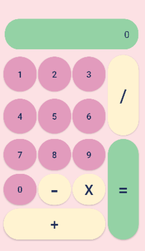
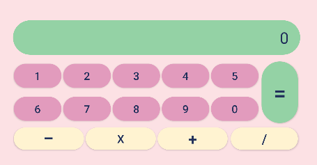

# 🌺 Macaron Calc


> Calculadora funcional para Android con diseño de colores pastel y manejo de operaciones aritméticas.

## 🌺 Descripción

Aplicación de calculadora desarrollada en **Android Studio con Java**. Realiza operaciones básicas (suma, resta, multiplicación, división) con una interfaz visual de tonos pastel. Incluye manejo de errores como división entre cero y formateo inteligente de resultados (enteros sin decimales).

## 🌺 Funcionalidades

-  **Operaciones básicas**: Suma (+), resta (-), multiplicación (x), división (/)
-  **Diseño responsivo**: Layouts separados para orientación portrait y landscape
-  **Formateo inteligente**: Muestra enteros sin `.0` y decimales con su formato natural
-  **Manejo de errores**: División entre cero muestra "Math Error"
-  **Interfaz limpia**: Botones con estilos personalizados (number_button, opera_button, result_button)
-  **Prevención de ceros a la izquierda**: No permite múltiples ceros al inicio

## 🌺 Tecnologías

| Tecnología | Uso |
|------------|-----|
| **Java** | Lógica de la calculadora (operaciones, flujo de datos) |
| **XML** | Diseño de interfaz (layouts en portrait y landscape) |
| **Android SDK** | Componentes nativos (AppCompatButton, TextView, LinearLayout) |
| **Drawables** | Estilos personalizados para botones |

## 🌺 Capturas de pantalla

|          Modo vertical           |           Modo horizontal           |
|:--------------------------------:|:-----------------------------------:|
|  |  |

## 🌺 Cómo ejecutarlo

```bash
git clone https://github.com/CrisOs6/Macaron_Calc
```